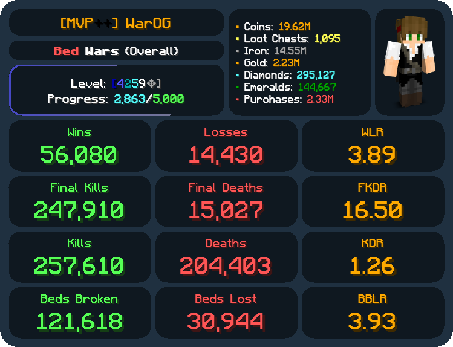
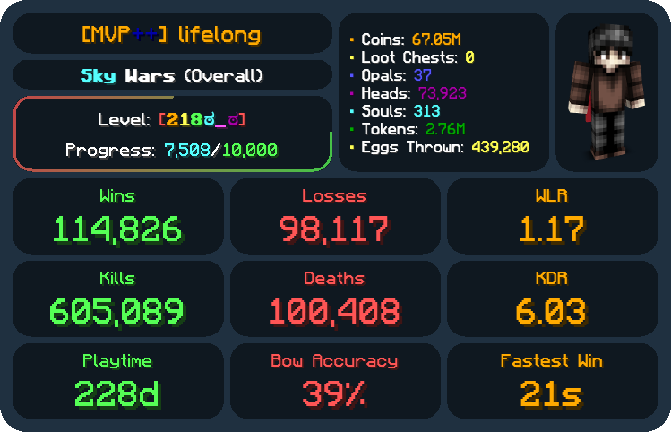
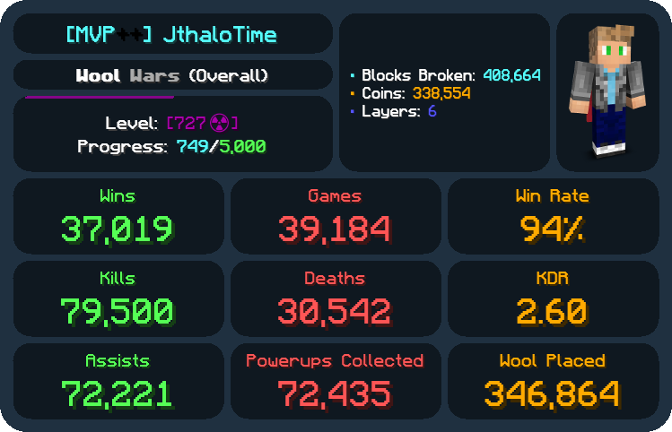
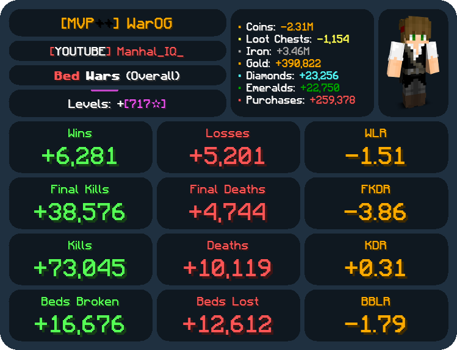
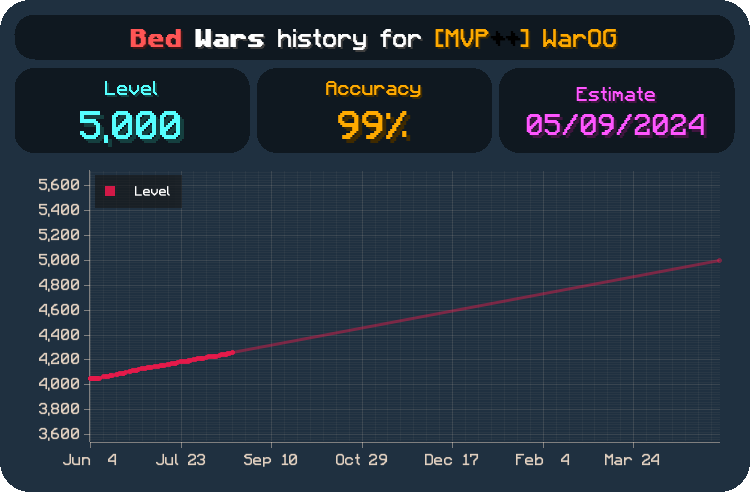

# StatPixel

## Documentation

Documentation for installing and contributing to StatPixel can be found in [docs](./docs/src/README.md).
It is recommended to build the documentation with [mdBook](https://github.com/rust-lang/mdBook) beforehand.

## License

StatPixel is licensed under the GPL-3.0 license. See [LICENSE](./LICENSE) for more information.

## Example images

